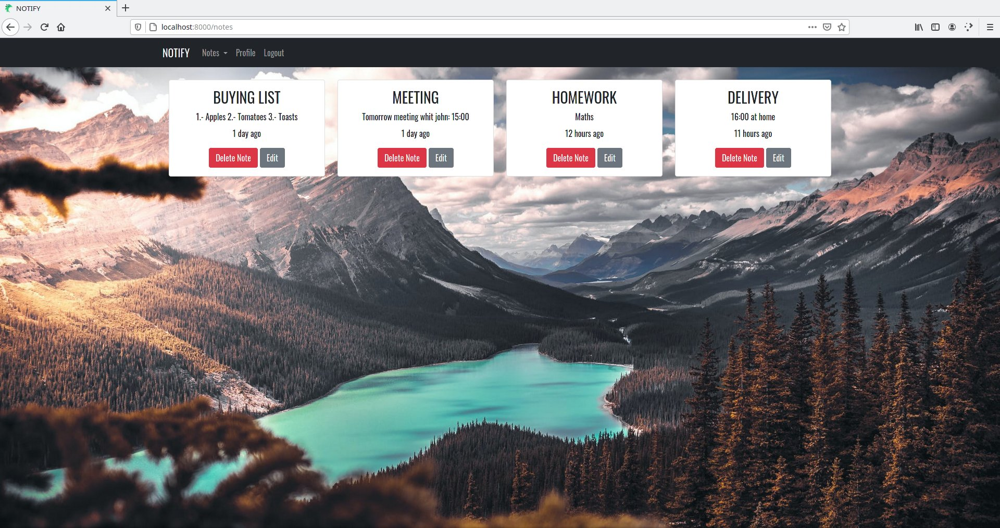

# NOTIFY
**NOTIFY** is a web page for taking and managing notes. Developed with ***Nodejs***, ***Express***, ***Handlebars*** and ***Mysql***, it is a **CRUD** application. Moreover, a **CRUD REST API** is also built.

## Structure
* database: sql querys to construct the database of the web page in mysql.\
* node-modules: all the nodemon installed modules.\
* src: code of the web server.\
  * lib: helpers.\
  * public: static dir for css and images.\
  * routes: the actual routes that the web server handles.\
  * view: all the views that are rendered throught the routes. They are .hbs file that contain html.\
* database.js: makes the connection with the database.\
* index.js: is the main file. All the web server is created and configured in this file. From here all the other files are require.\
* keys.js: all keys used in the application are stored here.\
